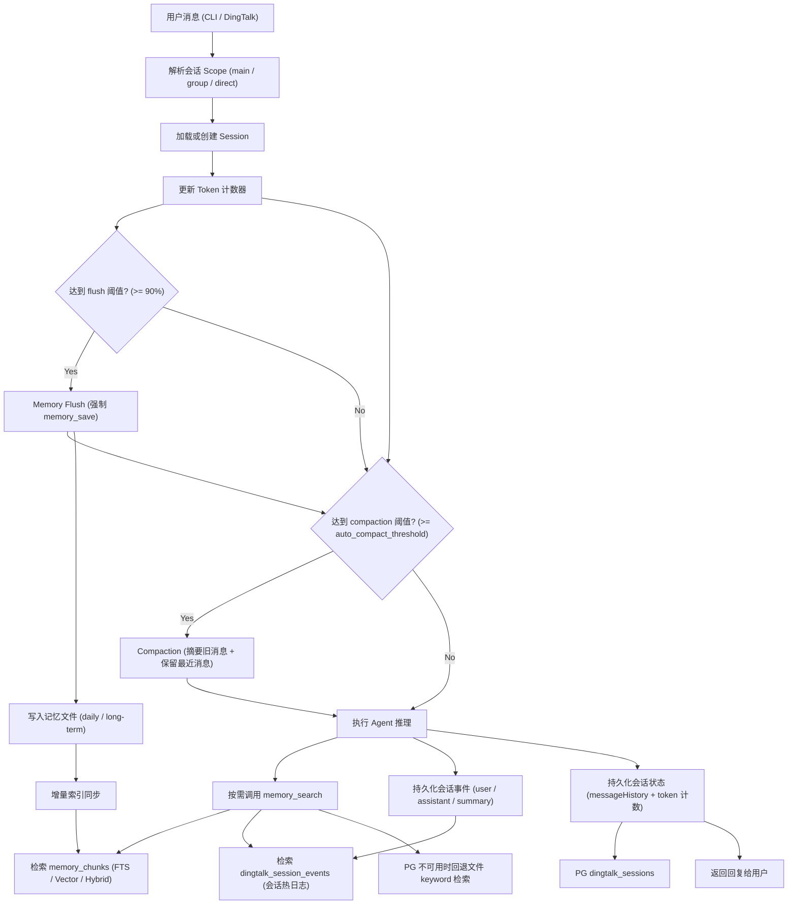
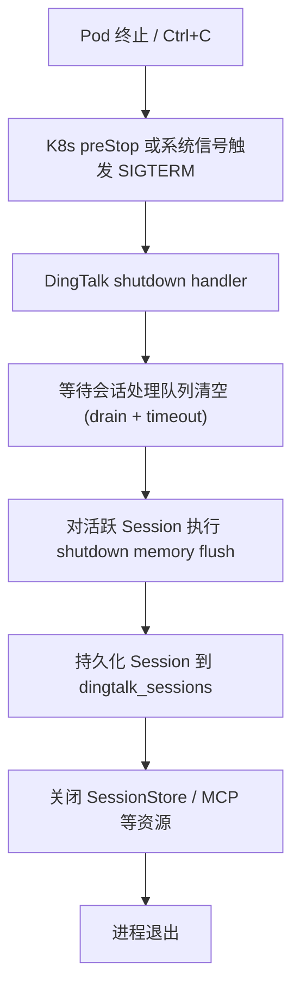

# Memory + Compaction 流程图（Pomelobot）

本文提供端到端流程图，覆盖：
- 在线消息处理路径（含 memory flush 与 compaction）
- 退出/重启路径（含 K8s preStop + SIGTERM 的关机保护）

---

## 1. 在线处理主流程

---

## 2. 退出/重启保护流程

补充说明：
- `SIGINT/SIGTERM` 可以触发上述保护流程。
- `SIGKILL` 无法被进程捕获，无法执行 flush（系统行为）。
